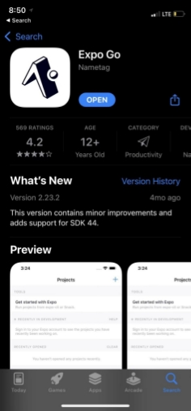

Since our App is deployed to Expo for now. An App called Expo Go should be downloaded to your smartphone:

For IOS:

<https://apps.apple.com/us/app/expo-go/id982107779?l=zh>

For Android:

<https://play.google.com/store/apps/details?id=host.exp.exponent&hl=en_US&gl=US>

`      		  `IOS							    Android

Once Expo is installed on your smartphone, open camera and scan the QR Code below:

For now, this QR Code only worked on Android devices, because Apple imposed new privacy restrictions. The team has to publish our app to the Apple Store or Apple TestFlight. The team is still processing the publish procedures. 
